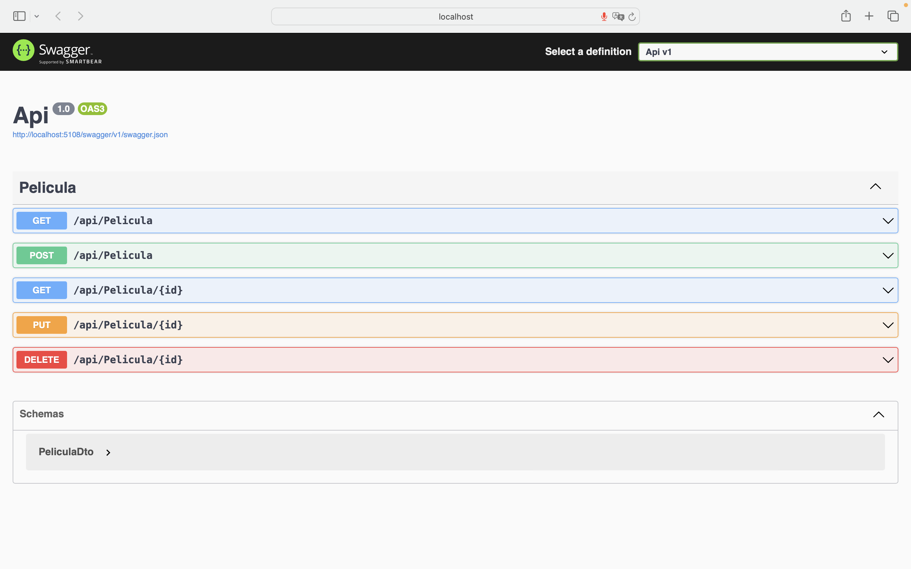

# API RESTful para CRUD de Películas

Este proyecto consiste en una API RESTful para gestionar películas utilizando el framework ASP.NET en C#. La API permite realizar operaciones CRUD (Crear, Leer, Actualizar, Eliminar) en películas.

## Endpoints

### Obtener Película:

- **Método:** GET
- **Endpoint:** `/api/Pelicula`
- **Campos de salida (respuesta exitosa):**
  - id (integer): El ID único de la película.
  - titulo (string): El título de la película.
  - director (string): El nombre del director de la película.
  - anio (integer): El año de lanzamiento de la película.
  - genero (string): El género de la película.

### Obtener Película por ID:

- **Método:** GET
- **Endpoint:** `/api/Pelicula/{id}`
- **Parámetros de ruta:**
  - id (integer): El ID único de la película que se desea obtener.
- **Campos de salida (respuesta exitosa):**
  - id (integer): El ID único de la película.
  - titulo (string): El título de la película.
  - director (string): El nombre del director de la película.
  - anio (integer): El año de lanzamiento de la película.
  - genero (string): El género de la película.

### Crear Película:

- **Método:** POST
- **Endpoint:** `/api/Pelicula`
- **Campos de entrada:**
  - titulo (string): El título de la película.
  - director (string): El nombre del director de la película.
  - anio (integer): El año de lanzamiento de la película.
  - genero (string): El género de la película.
- **Campos de salida (respuesta exitosa):**
  - id (integer): El ID único asignado a la película.
  - titulo (string): El título de la película.
  - director (string): El nombre del director de la película.
  - anio (integer): El año de lanzamiento de la película.
  - genero (string): El género de la película.

### Actualizar Película:

- **Método:** PUT
- **Endpoint:** `/api/Pelicula/{id}`
- **Parámetros de ruta:**
  - id (integer): El ID único de la película que se desea actualizar.
- **Campos de entrada:**
  - titulo (string, opcional): El nuevo título de la película.
  - director (string, opcional): El nuevo nombre del director de la película.
  - anio (integer, opcional): El nuevo año de lanzamiento de la película.
  - genero (string, opcional): El nuevo género de la película.
- **Campos de salida (respuesta exitosa):**
  - id (integer): El ID único de la película.
  - titulo (string): El título actualizado de la película.
  - director (string): El nombre del director actualizado de la película.
  - anio (integer): El año de lanzamiento actualizado de la película.
  - genero (string): El género actualizado de la película.

### Eliminar Película:

- **Método:** DELETE
- **Endpoint:** `/api/Pelicula/{id}`
- **Parámetros de ruta:**
  - id (integer): El ID único de la película que se desea eliminar.
- **Respuesta exitosa:**
  - Código de estado HTTP 204 (Sin contenido).

## Observaciones

- Se espera que la API maneje correctamente los casos de error, como solicitudes inválidas o recursos no encontrados, devolviendo los códigos de estado HTTP apropiados y mensajes descriptivos en la respuesta.
- Para la operación de Actualizar Película, la API debe ser capaz de manejar actualizaciones parciales, es decir, actualizar solo los campos proporcionados en la solicitud y mantener los campos no proporcionados sin cambios.

## Ejecución del Proyecto

1. Clona el repositorio o descarga el código fuente.
2. Abre el proyecto en tu entorno de desarrollo preferido.
3. Asegúrate de tener todas las dependencias instaladas.
4. Ejecuta el proyecto.
5. La API estará disponible en `http://localhost:5108`.

¡Disfruta utilizando la API para gestionar tus películas! Si tienes alguna pregunta o problema, no dudes en contactar al equipo de desarrollo.

